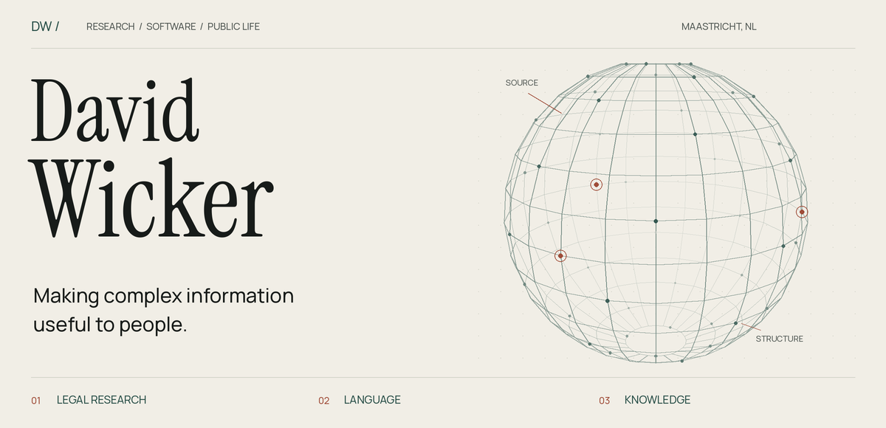
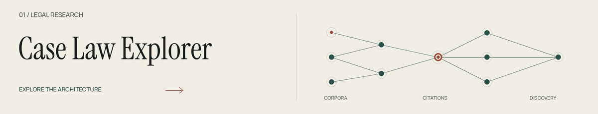
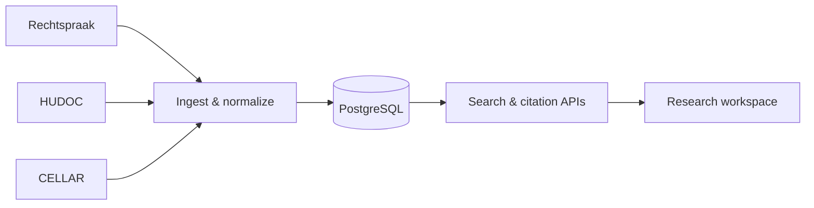
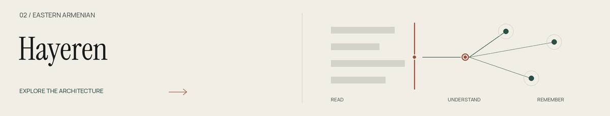
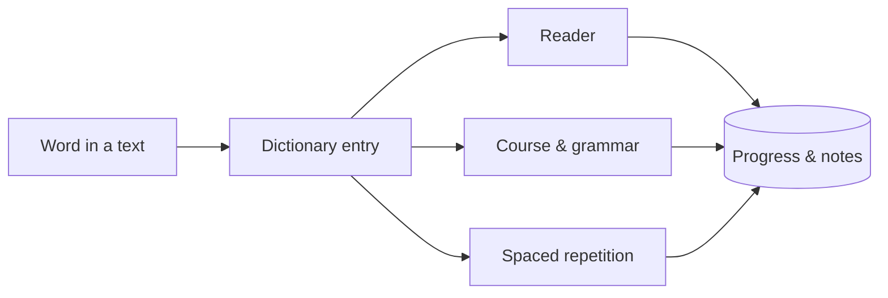
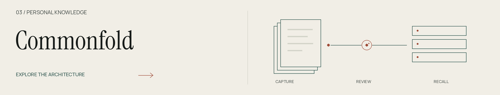
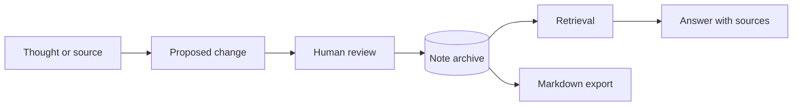

<a href="https://wicker.life">
  <picture>
    <source media="(prefers-reduced-motion: reduce) and (prefers-color-scheme: dark)" srcset="assets/hero-dark.png">
    <source media="(prefers-reduced-motion: reduce)" srcset="assets/hero-light.png">
    <source media="(prefers-color-scheme: dark)" srcset="assets/hero-dark.png">
    
  </picture>
</a>

  <a href="https://wicker.life"><b>Portfolio ↗</b></a> &nbsp; / &nbsp;
  <a href="#selected-work">Selected work</a> &nbsp; / &nbsp;
  <a href="#public-code">Public code</a> &nbsp; / &nbsp;
  <a href="#beyond-software">Beyond software</a> &nbsp; / &nbsp;
  <a href="https://wicker.life/collaborate">Get in touch ↗</a>

# I'm David.

Full-stack developer and researcher in **Maastricht, the Netherlands**. I build software for working with complex information: court decisions, Armenian texts, and personal knowledge.

At the [Brightlands Institute for Smart Society](https://www.biss-institute.com/en/team/david-wicker), I work on legal research infrastructure with the Maastricht research and engineering teams. Independently, I design and build language-learning tools, knowledge systems, and client websites.

[CV](https://wicker.life/cv) · [Research](https://wicker.life/research) · [LinkedIn](https://www.linkedin.com/in/davidwickerhf/)

## Selected work

<a href="https://wicker.life/research/case-law-explorer">
  <picture>
    <source media="(prefers-reduced-motion: reduce) and (prefers-color-scheme: dark)" srcset="assets/case-law-dark.png">
    <source media="(prefers-reduced-motion: reduce)" srcset="assets/case-law-light.png">
    <source media="(prefers-color-scheme: dark)" srcset="assets/case-law-dark.png">
    
  </picture>
</a>

Research software connecting Dutch and European case law through search and citation networks. I contribute across ingestion, data normalization, APIs, authentication, the research interface, and deployment.

`Python` · `Airflow` · `PostgreSQL` · `SvelteKit` · `Docker`

<b>Inside the system</b> — from court records to a research workspace

Rechtspraak, HUDOC, and CELLAR enter through separate ingestion paths and converge on a shared legal-data model. Source-specific records and citation relationships remain traceable. The work is part of a wider BISS and Maastricht research programme.

[Read the architecture](https://wicker.life/research/case-law-explorer) · [Explore the ingestion code](https://github.com/maastrichtlawtech/cellar-extractor)

 

<a href="https://wicker.life/projects/hayeren">
  <picture>
    <source media="(prefers-reduced-motion: reduce) and (prefers-color-scheme: dark)" srcset="assets/hayeren-dark.png">
    <source media="(prefers-reduced-motion: reduce)" srcset="assets/hayeren-light.png">
    <source media="(prefers-color-scheme: dark)" srcset="assets/hayeren-dark.png">
    
  </picture>
</a>

An Eastern Armenian learning platform, shaped by my own experience learning the language. A graded course, grammar, a dictionary that recognizes inflected words, reading, spaced repetition, and shared notebooks all draw on the same language data.

`TypeScript` · `React` · `Neon Postgres` · `Liveblocks` · `Yjs`

<b>Inside the system</b> — one word, across every learning surface

A word encountered in a text resolves to a stable dictionary entry. That same record supports lookup, study, and review. Shared packages hold the language and learning logic; Postgres preserves learner progress and notes.

[Read the architecture](https://wicker.life/projects/hayeren) · [Try Hayeren](https://hayeren.io)

 

<a href="https://wicker.life/projects/commonfold">
  <picture>
    <source media="(prefers-reduced-motion: reduce) and (prefers-color-scheme: dark)" srcset="assets/commonfold-dark.png">
    <source media="(prefers-reduced-motion: reduce)" srcset="assets/commonfold-light.png">
    <source media="(prefers-color-scheme: dark)" srcset="assets/commonfold-dark.png">
    
  </picture>
</a>

A private knowledge system in active development. AI proposes changes for review and answers questions with links to their sources. Notes support collaborative editing, version history, and portable Markdown export.

`Next.js` · `PostgreSQL / pgvector` · `Claude` · `TipTap` · `Yjs`

<b>Inside the system</b> — review what enters, trace what comes back

Capture starts with a proposal. After review, the note becomes part of a Postgres archive. Keyword and semantic retrieval supply evidence for answers; version history and Markdown export keep the archive recoverable.

[Read the architecture](https://wicker.life/projects/commonfold) · [Visit Commonfold](https://commonfold.space)

## Public code

A few entry points into my research software and contributions:

| Repository | What it does |
| --- | --- |
| [cellar-extractor](https://github.com/maastrichtlawtech/cellar-extractor) | Extracts and enriches EU case law with full text, metadata, and citation relationships. |
| [cjeu-migration](https://github.com/davidwickerhf/cjeu-migration) | Runs resumable case-law extraction and publishes research datasets to Hugging Face. |
| [metricanalysis](https://github.com/davidwickerhf/metricanalysis) | Compares graph centrality measures against reference data. |

[More projects and architecture notes ↗](https://wicker.life/projects)

## Beyond software

I photograph places and everyday life, study Eastern Armenian, and work on educational access for students affected by conflict. Earlier chapters include UWC Dilijan in Armenia and climate organising in Turin.

[Photography](https://wicker.life/photography) · [Humanitarian work](https://wicker.life/humanitarian-work) · [Earlier work](https://wicker.life/archive)

---

**Have a difficult system to make usable?** [Let's talk ↗](https://wicker.life/collaborate)

Original artwork, rendered from code. [Animated version](README.md) · [How this README works](DESIGN.md)
